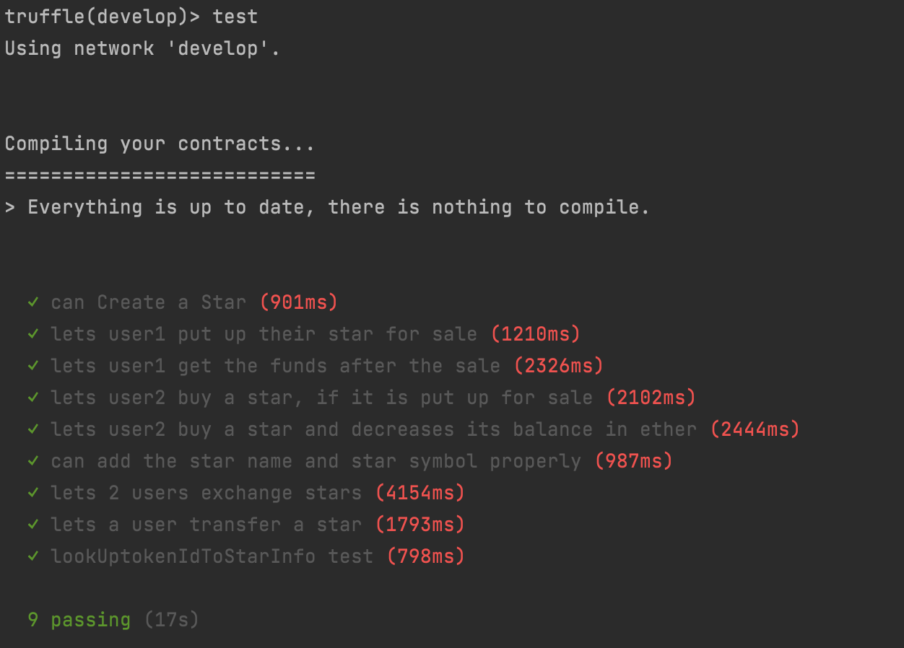
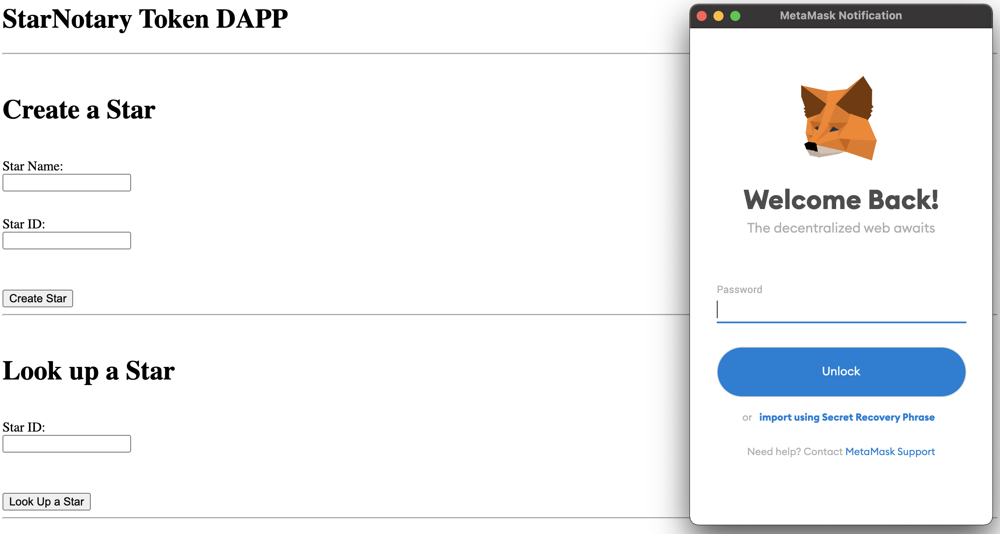

# Udacity Capstone Project 1: StarNotary NFT Project
## Project specifications:
**ERC-721 Token Name:** StarNotary\
**ERC-721 Token Symbol:** STN \
**Version of Truffle:** Truffle v5.5.1 (core: 5.5.1)\
**Version of OpenZeppelin:** 2.3\
**Token Address (Rinkeby Network):** 0xC5595fe3548f0957216214E5C6d7A063af6D42d3\
**Solidity Version:** "0.8.0"

**NOTE**: Due to security updates on web3js library and metamask, the source code (solidity and javascript code) from the stater code had to be upgraded and refactored.
## Project descripton:
So this proyect consist of a smart-contract called "StarNotary" which represents an NFT. From this contract we can create NFT Tokens with certain characteristics. In this case we can create a star with a "name" and an "id". Afterwards we can lookup the owner of a star by it's "id". All of this is done thorugh the UI.

Further more additional functionality has been added to the contract where you can manually create a star, put a star for sale, buy a star, exchnage stars, look up for start by ID plus all default ERC-721 token features.
## How to run using docker-compose?
1. Run "dev_build.sh" (Creates necessary docker images)
2. Run "dev_run.sh" (Executes docker-compose-dev.yml)
3. Run "dev_clean_up.sh" (Takes down all running or stopped containers)
4. Three containers will be deployed:
   - truffle-drizzle: Used for compiling and deploying Smart Contracts to local, test and production chains.
   - nodejs-server: Used for managing and debugging front-end. Mainly used for starting up the web app.
   - ganache-cli: Used as a local blockchain for testing and developing purposes.

5. To interact with "truffle-drizzle" container use the following command to start a session: **docker exec -it truffle-drizzle bash**
6. To interact with "node-js-server" container use the following command to start a session: **docker exec -it node-js-server bash**
7. For more in formation on how to use truffle drizzle suite using docker-compose please visit: https://github.com/lzhou1110/drizzle-truffle-ganache-docker-box

## How to run truffle tests?
1. Start a session on the truffle-drizzle container: **docker exec -it truffle-drizzle bash**
2. Once inside the container run the following:
   - truffle develop
   - compile
   - migrate --reset
   - test
3. Your output should look like the following:

## How to run UI (Front-end)?
1. Start a session on the truffle-drizzle container: **docker exec -it truffle-drizzle bash**
2. Run command: **npm run dev**
3. Now open your browser on **localhost:3001** or **127.0.0.1:3001**

## Resources used:
- https://github.com/lzhou1110/drizzle-truffle-ganache-docker-box
- https://faucets.chain.link/rinkeby
- https://trufflesuite.com/docs/truffle/getting-started
- https://bitsofco.de/calling-smart-contract-functions-using-web3-js-call-vs-send/
- https://infura.io/
- https://andresaaap.medium.com/how-to-deploy-a-smart-contract-on-a-public-test-network-rinkeby-using-infura-truffle-8e19253870c4
- https://stackoverflow.com/
- https://docs.metamask.io/guide/
